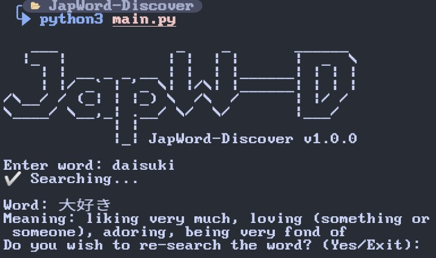

# JapWord-Discover-CLI

<p align="center">
  <a name="top" href="#octocat-hi-there-thanks-for-visiting-">
    
  </a>
</p>

# Info

<p align="center">

 <a href="https://github.com/tegarsabila">
    
  </a>
<a href="https://github.com/tegarsabila/followers">
  </a>
<a href="https://github.com/tegarsabila/JapWord-Discover-CLI/stargazers/">
<a href="https://github.com/tegarsabila">
  
</a>
<a href="https://github.com/tegarsabila">
  
</a>
<a href="https://github.com/tegarsabila">
  
</a>
<a href="https://github.com/tegarsabila">
  
</a>
</div>
</p>

##
### :octocat: Hi, thanks for spending your time visiting this repository !
<p>
  JapWord-Discover is a tools where you may look up the meanings of Japanese words.
</p>

# Installation Package
<details open>
<summary>Termux (Android) / Linux</summary>

- ```bash
  $ apt update && apt upgrade
  ```

- ```bash
  $ apt install python3 git -y
  ```

## Installation Project

- ```bash
  $ git clone https://github.com/tegarsabila/JapWord-Discover-CLI
  ```

- ```bash
  $ cd JapWord-Discover-CLI
  ```

- ```bash
  $ pip install -r requirements.txt
  ```

- ```bash
  $ python3 main.py
  ```